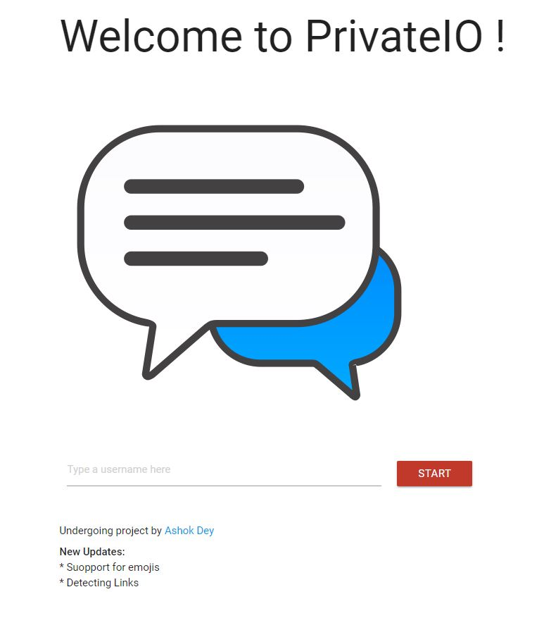
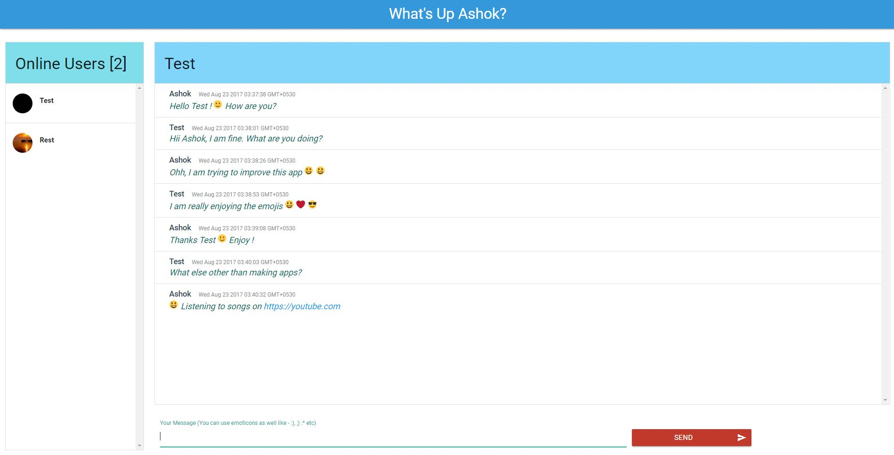

# PrivateIO - P2P Chatting
_Somewhat close to **Whatsapp** still far far away..._


### Made using:
- **React** for UI
- **Node** for Server
- **SocketIO** for instant chats

### Noteworthy
- Support for your favorite **Emojis**
- Suppot for detecting links

### How to run? 
- Clone the repo
- ```npm install``` : To install all the packages
- ```npm start``` : To start the server

### For Devs
- ```npm run webpack``` : To run webpack in watch mode
- ```npm run wp``` : To run webpack for production build
- ```npm run dev``` : To run server with nodemon

### TODOS
- Proper chatrooms ```!important```
- Message count badge for chats from other users
- Tons of style fixes
- Sidebar containing online users for mobile devices
- Typing.. beside the name of the user like - User (Typing now..) 


#### Screens

<br/><br/>
